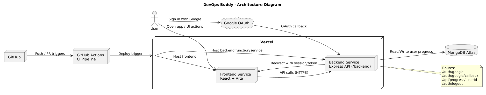
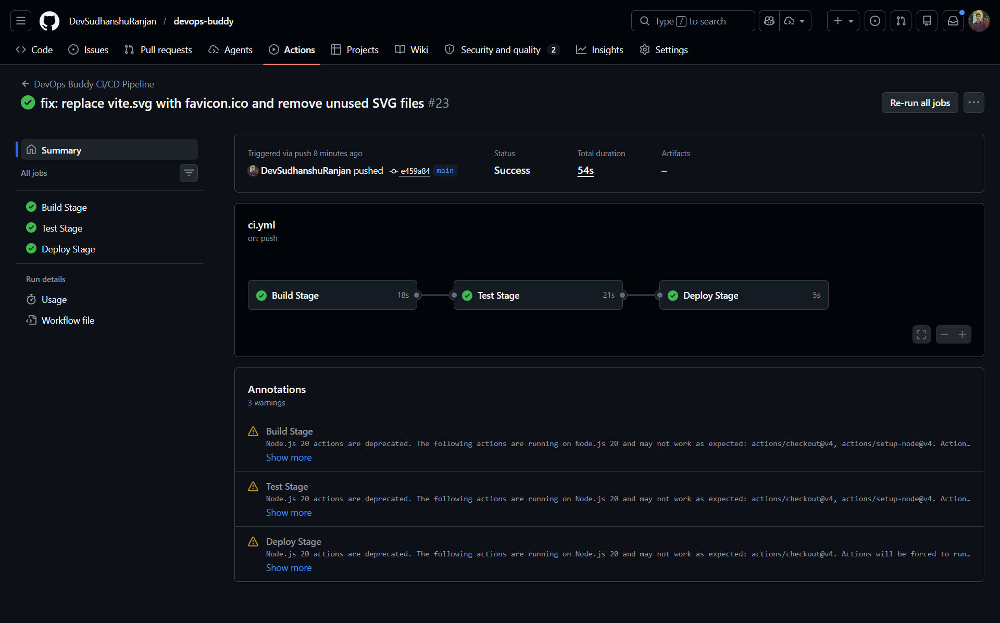
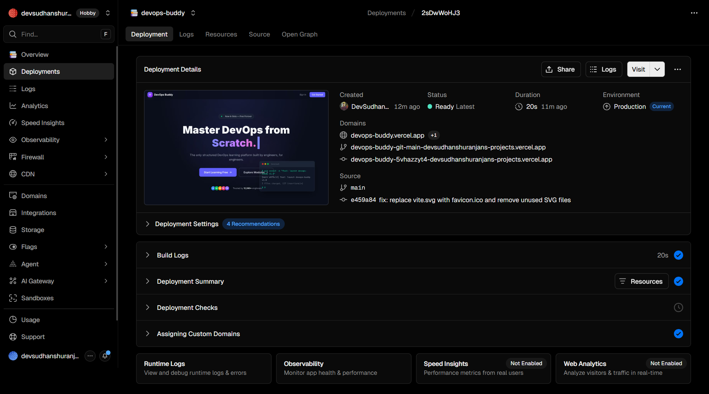

# 1. Project Title

## DevOps Buddy

DevOps Buddy is an interactive learning platform built to help students and engineers learn practical DevOps topics such as Git, GitHub, CI/CD, containers, and deployment workflows through lessons, quizzes, and progress tracking.

### Team Members
- Sudhanshu Ranjan - Frontend, Backend, Deployment
- Vaishnavi Joshi - CI/CD Pipeline, GitHub Actions, Documentation

# 2. Problem Statement

Many beginners struggle to learn DevOps in a structured and practical way because most resources are fragmented across blogs, videos, and tool documentation. The problem this project solves is the lack of a single, guided platform that combines theory, practical module flow, quiz validation, and deployment-ready engineering practices.

DevOps Buddy addresses this by providing:
- Structured module-based learning content
- Progress tracking for each user
- Integrated authentication and profile-based experience
- CI/CD aligned development and deployment workflow

# 3. Architecture Diagram (image required)

# 4. CI/CD Pipeline Explanation

This project uses GitHub Actions as the CI pipeline and Vercel Git integration for deployment.

### Pipeline Stages
- Build Stage: Installs dependencies and builds the frontend application.
- Test Stage: Runs tests and lint checks to ensure code quality.
- Deploy Stage: Deployment is triggered from Vercel integration for the main branch after pipeline success.

### Quality Gates Included
- ESLint checks for frontend and backend code standards
- Frontend production build verification
- Backend Jest test suite execution

# 5. Git Workflow Used

- Main branch is used as the stable production branch.
- Feature work is developed in separate feature branches.
- Changes are integrated through pull requests.
- CI checks must pass before merge to keep main branch stable.

# 6. Tools Used

- React 19
- Vite
- Tailwind CSS v4
- Lucide React
- Node.js
- Express.js
- MongoDB Atlas
- Passport Google OAuth
- GitHub Actions
- Vercel
- Git and GitHub

# 7. Screenshots

Place these screenshots inside the root screenshots folder:
- screenshots/pipeline-success.png
- screenshots/deployment-output.png

### Pipeline Success

### Deployment Output

